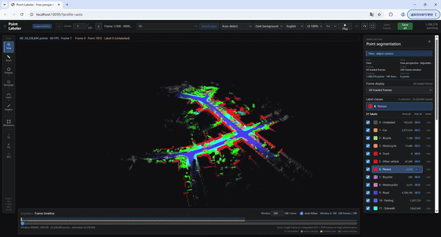

# point-labeling-web

面向公开点云格式的 Web 语义点标注工具。当前以 SemanticKITTI / KITTI 的逐帧 Velodyne 点云为基线，提供 Windows 发布包、浏览器标注界面和可复现的开发测试入口。

> **核心能力 / GPU Windows Web**：重点面向带独立 GPU 的 Windows 电脑，在浏览器中直接完成约 **5,000 万点级（50M-scale）**点云的流式渲染、跨帧浏览和标注，不要求切换到桌面客户端。当前已用约 4,582.5 万点 Clip 做过验证；实际流畅度取决于独显型号、显存、驱动和浏览器。

[中文（默认）](README.md) | [English](README_EN.md)

## 演示 / Demo

下面的视频展示了公开格式测试包中的点云浏览、工具切换和标签编辑流程。视频文件通过 Git LFS 保存在本仓库中：

<p align="center">
  <a href="https://github.com/huixiancheng/point-labeling-web/raw/refs/heads/main/assets/usage_demo.mp4">
    
  </a>
</p>

[▶ 下载 / 播放完整原始演示视频（MP4，约 118.6 MB）](https://github.com/huixiancheng/point-labeling-web/raw/refs/heads/main/assets/usage_demo.mp4)

完整 GIF 会在 GitHub README 中自动播放并按 960 px 宽度展示；点击 GIF 或上面的链接即可由浏览器直接播放或下载完整原始 MP4。Windows 二进制包已发布到 [GitHub Releases v0.1.1](https://github.com/huixiancheng/point-labeling-web/releases/tag/v0.1.1)，也可直接[下载 Windows 发布包](https://github.com/huixiancheng/point-labeling-web/releases/download/v0.1.1/PointLabelingWeb-Windows-v0.1.1.zip)。源码构建方式见下方“构建和测试”。详情见 [`assets/README.md`](assets/README.md)。

## 可直接测试 / 20-frame test data

提供一个可直接放进 Windows 包 `clips` 目录的 SemanticKITTI `00` 序列前 20 帧测试包：

[下载 SemanticKITTI-00-20frames.zip（约 29.6 MB）](assets/SemanticKITTI-00-20frames.zip)

解压后得到 `clips/semantic_kitti/sequences/00/`，双击 `PointLabelerLauncher.exe`，选择“开启标注”即可测试。该压缩包包含 `.bin`、`.label`、`poses.txt`、`calib.txt` 和数据许可说明；数据不适用本项目 MIT 代码许可，使用和再分发请遵守 SemanticKITTI 的 CC BY-NC-SA 条款。

## 项目结构 / Project layout

| 路径 | 用途 |
| --- | --- |
| `frontend/` | Three.js + TypeScript 标注界面；中英文切换、工具、时间线和性能模式都在这里。 |
| `server/` | C++/Qt HTTP 服务、数据扫描、姿态对齐、标签读写和 Windows 播放器接口。 |
| `docs/` | 数据格式边界、使用说明、开发说明和 Wiki 草稿。 |
| `tools/` | SemanticKITTI 测试数据拉取与校验脚本。 |
| `windows/` | Windows 构建脚本、图形启动器和可运行测试包。 |
| `CHANGELOG.md` / `VERSION` | 发布版本和变更记录。 |
| `windows/package_open/clips/` | 本地回归用的 SemanticKITTI `00` 序列测试夹具（保留 300 帧）；按 `.gitignore` 排除，不会推送到源码仓库。 |
| `clips/`、`logs/` | 源码开发时的本地数据和日志目录；不应提交真实或私有数据。 |

## 快速开始 / Quick start

### Windows 发布包

发布包使用固定目录，数据和程序分离：

```text
PointLabelingWebOpen-Windows-<date>/
├─ PointLabelerLauncher.exe      # 开启、停止、更新和退出
├─ app/                          # exe、web、assets、Qt/MSVC DLL
├─ clips/                        # 放公开点云数据
├─ logs/                         # server.log 和前台调试日志
└─ update/                       # 可选的新 app/启动器更新文件
```

1. 将完整的 SemanticKITTI/KITTI 数据目录放到 `clips`。
2. 双击 `PointLabelerLauncher.exe`，选择“开启标注”。启动器提供“开启标注、结束标注、更新、退出程序”四个核心操作，并支持标题栏最小化和“隐藏到托盘”。
3. 浏览器访问 <http://localhost:8090/>；启动器会在服务启动后自动打开页面。
4. 结束时在启动器中选择“结束标注”，或直接退出启动器；退出启动器会自动结束当前发布包的服务。

启动器中可以直接修改端口和性能模式。`auto`、`high`、`low` 分别表示自动检测、高性能 200 帧窗口、集显/低性能单帧窗口。

标题栏“最小化”和启动器内的“隐藏到托盘”是两个独立功能：最小化保留任务栏恢复入口，隐藏到托盘则隐藏任务栏窗口但保持服务运行。托盘图标支持单击恢复；关闭窗口或从托盘退出前会提醒网页可能存在未保存标签，请先确认页面显示“0 个待保存”。

### 源码开发启动

前端：

```powershell
cd frontend
pnpm install
pnpm run build
```

后端示例：

```powershell
.\server\build_open\Release\point_labeler_server.exe `
  --root E:\data\SemanticKITTI `
  --assets .\server\assets `
  --web-root .\frontend\dist `
  --port 8090
```

Windows 前台日志调试（需要先完成后端构建）：

```powershell
.\server\build_open\Release\point_labeler_server.exe `
  --root "D:\datasets\SemanticKITTI" `
  --assets .\server\assets `
  --web-root .\frontend\dist `
  --log .\logs\server-foreground.log `
  --host 127.0.0.1 `
  --port 18090
```

前台日志写入 `logs/server-foreground.log`；发布包后台日志写入 `logs/server.log`。更完整的构建和调试流程见 [`docs/DEVELOPMENT.md`](docs/DEVELOPMENT.md)。

## 数据组织 / Data layout

### SemanticKITTI

服务会递归发现 `velodyne` 序列；完整数据可以放在 `clips` 下的任意公开目录层级：

```text
clips/
└─ semantic_kitti/
   └─ sequences/
      └─ 00/
         ├─ velodyne/000000.bin
         ├─ labels/000000.label       # 可选；没有时按未标注加载
         ├─ poses.txt                  # 可选；用于帧堆叠
         └─ calib.txt                  # 可选；与 poses.txt 配合
```

`.bin` 每个点是小端 `float32 x,y,z,remission`；`.label` 每个点是小端 `uint32`。界面显示 SemanticKITTI 训练类别 0–19 和 255 未标注，写回时保留未修改点的原始 `uint32`（包括 instance 高 16 位）。

### KITTI

支持 KITTI Odometry 的 `velodyne/*.bin`、KITTI Object 的 `training/testing/velodyne`，以及直接包含 `.bin` 的目录。KITTI Object 的 `label_2/*.txt` 是 3D 框标签，不会被误读为逐点 `.label`；人工逐点标签会写入同级 `labels/*.label`。

更完整的扫描规则、姿态对齐和导出协议见 [`docs/OPEN_FORMATS.md`](docs/OPEN_FORMATS.md)。

## 标注界面 / Annotation UI

- 顶部“语言”下拉框可在中文和 English 之间切换；选择会保存在当前浏览器，下次打开继续使用。
- 性能模式只改变加载窗口和显示范围，不对服务端点云静默降采样；低性能模式默认单帧，高性能模式默认 200 帧。
- 画刷半径使用固定的 3D 世界尺度，当前范围为 1–100，默认 8（约 8 cm，取决于数据坐标单位）。折线高度过滤范围为 1–100，默认 15（约 ±15 cm）。
- `Ctrl+S` 保存全部待保存标签；当前帧导出标准 `.label`，全 Clip 导出 `.plwlabels`。
- 检测到 Clip 内的视频时，可以使用“默认播放器”调用 Windows 系统默认播放器，不依赖浏览器播放。

常用快捷键：

| 快捷键 | 功能 |
| --- | --- |
| `N`、`1`–`5` | 视角、画刷、多边形、矩形、套索、折线 |
| `V` | 循环视角 |
| `B` | 鸟瞰与上一次自动透视视角切换 |
| `F` / `G` | 进入或退出飞行视角 |
| `Enter` / 右键 | 应用当前多边形、选区或折线 |
| `Ctrl+S` | 保存全部修改 |
| `Ctrl+Z` / `Ctrl+Y` | 撤销 / 重做 |

工作区请点击左侧工具栏按钮选择，不占用飞行视角的 `W` 移动键。

## 致谢与参考项目

本项目是独立的开源实现，不隶属于下列项目或其维护者。开发过程中对公开代码、数据组织方式、标注交互和产品设计进行了学习与参考；本项目自己的代码按根目录的 [MIT License](LICENSE) 发布，下列项目的许可证和版权归属不因本项目采用 MIT 而改变。

- 感谢 [jbehley/point_labeler](https://github.com/jbehley/point_labeler)。SemanticKITTI/KITTI 点云组织、逐点标签处理、跨帧/姿态相关思路以及部分点云标注交互设计参考了其公开实现和文档；该项目采用 [MIT License](https://github.com/jbehley/point_labeler/blob/master/LICENSE)。
- 感谢 [xtreme1-io/xtreme1](https://github.com/xtreme1-io/xtreme1)。标注工作台组织、时间线、标签面板、交互式可视化和部分前端功能设计参考了其公开代码、文档和产品形态；该项目采用 [Apache License 2.0](https://github.com/xtreme1-io/xtreme1/blob/main/LICENSE)。

本仓库的前端、后端、Windows 脚本和文档由本项目单独维护；参考上述项目不表示存在官方合作、授权关系或产品隶属关系。SemanticKITTI、KITTI 数据集及其标签不属于本项目，使用者需要遵守各自的数据许可和使用条款。第三方依赖的许可证见 [NOTICE](NOTICE)。

## 文档 / Documentation

- [`docs/USAGE.md`](docs/USAGE.md)：安装、数据放置、标注、保存、导出和故障排查。
- [`docs/DEVELOPMENT.md`](docs/DEVELOPMENT.md)：架构、构建、测试、打包和贡献约定。
- [`docs/OPEN_FORMATS.md`](docs/OPEN_FORMATS.md)：SemanticKITTI/KITTI 支持边界和标签协议。
- [`docs/README.md`](docs/README.md)：文档导航、维护边界和文件职责。
- [`docs/RELEASE.md`](docs/RELEASE.md)：开源发布检查、Windows 包验收和 Release 资产组织。
- [`CONTRIBUTING.md`](CONTRIBUTING.md)：贡献前检查和 Pull Request 约定。
- [`SECURITY.md`](SECURITY.md)：本地服务边界和安全问题报告方式。
- [`CHANGELOG.md`](CHANGELOG.md)：版本变更记录。
- 本 README 的“致谢与参考项目”章节：第三方项目和设计/代码参考说明。
- GitHub Wiki 的使用页以 [`docs/WIKI_USAGE.md`](docs/WIKI_USAGE.md) 为源稿。

## 构建和测试 / Build and test

前端生产构建需要 Node.js `>=20.19.0`、npm 或 pnpm。Windows 包构建还需要 CMake、Visual Studio C++、Qt 和 `windeployqt`：

```powershell
.\windows\build_package.ps1 `
  -QtPrefix "C:\Qt\5.15.2\msvc2019_64" `
  -OutputDir "E:\build\PointLabelingWebOpen-Windows"
```

建议将 `-OutputDir` 指向新的构建目录；不要在包含真实 `clips` 和 `logs` 的工作包上直接运行清理式构建。更新现有包时，将新版本的 `app` 放入 `update\app`，如果启动器也有新版本则同时放入 `update\PointLabelerLauncher.exe`，然后在 `PointLabelerLauncher.exe` 中选择“更新”；它不会覆盖 `clips` 和 `logs`。

完整的开源发布检查、Release 资产组织和包内容验收见 [`docs/RELEASE.md`](docs/RELEASE.md)。

## 开发源码与发布结果 / Source and releases

源码仓库只保留可维护的开发内容：`frontend/src`、`server/src`、`windows` 启动器源码、构建脚本、测试脚本和文档。前端 `dist`、CMake/Visual Studio 构建目录、Qt 运行库以及完整 Windows 包均属于生成结果，不应提交到源码历史。

Windows 构建结果建议打成一个压缩包，作为 GitHub Release asset 上传，例如 `PointLabelingWebOpen-Windows-<date>.zip`；当前 `v0.1.1` 发布包可从 [GitHub Release](https://github.com/huixiancheng/point-labeling-web/releases/tag/v0.1.1) 下载。`usage_demo.mp4` 已通过 Git LFS 纳入本仓库，不再依赖 Release 上传。`windows/package_open` 是本地的 SemanticKITTI 300 帧测试夹具，已排除在源码提交之外；`assets/SemanticKITTI-00-20frames.zip` 是专门保留给别人快速测试的公开 20 帧数据资产。

发布包中的 `PointLabelerLauncher.exe` 由 `windows/launcher/PointLabelerLauncher.cs` 编译得到。发布包只提供 EXE 作为服务入口：启动器直接控制服务进程并执行 app 更新，避免多个脚本入口造成重复服务。

## 许可与数据责任 / License and data responsibility

本项目自己的代码按 [MIT License](LICENSE) 发布，允许商业使用、修改和分发，但必须保留许可证和版权声明。第三方依赖与参考项目仍适用各自许可证，详见 [NOTICE](NOTICE) 和上面的“致谢与参考项目”章节。

本项目代码不包含专有数据或仓库凭据。SemanticKITTI、KITTI 数据和标签受各自许可证及使用条款约束；使用者需要自行确认数据的下载、分发和标注结果是否符合相应条款。
